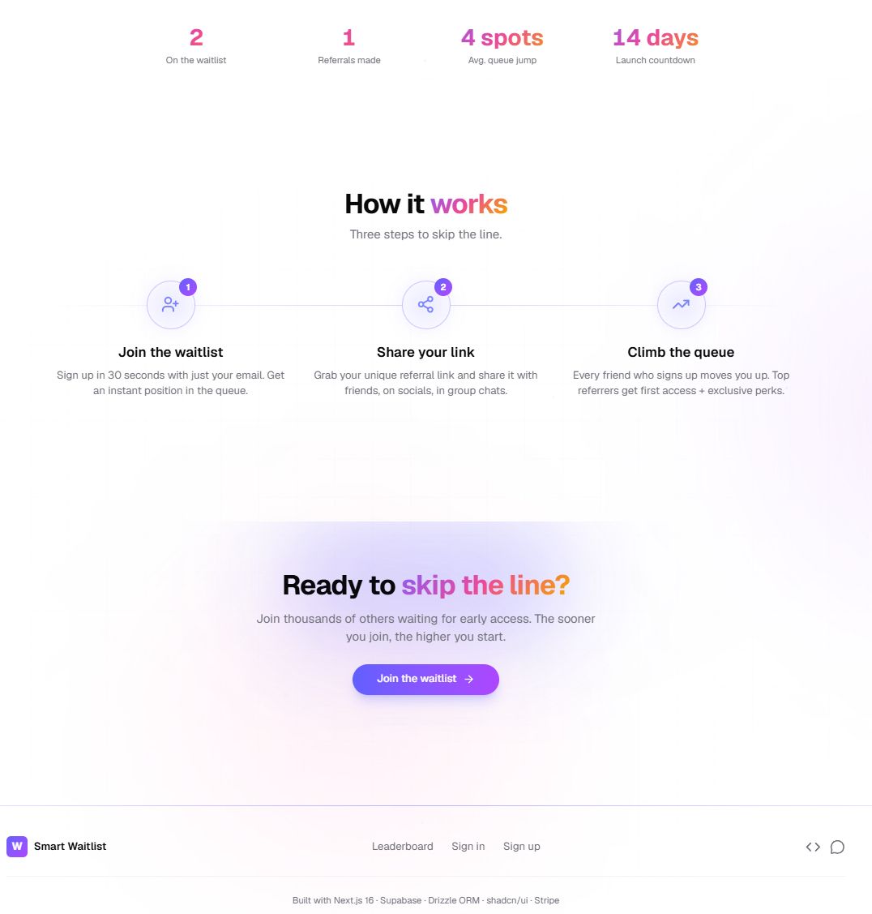

# Smart Waitlist & Referral Engine

Production-ready SaaS waitlist with viral referral loops, live position tracking, admin analytics, Stripe tiers, and full RLS. Built with Next.js 16, Supabase, Drizzle ORM, and shadcn/ui.


## Live Demo

**https://smart-waitlist-engine.vercel.app/**

> Full-stack live. Supabase (Auth + Postgres + RLS) is healthy. Sign up, get a referral link, climb the queue, and explore the admin dashboard.

## Screenshots

| Landing / Hero | How it works |
|---------------|--------------|
|  |  |

| Dashboard | Admin / Analytics |
|-----------|-------------------|
|  |  |

## Features

- **Viral referral engine** — unique referral codes, position leapfrogging, live leaderboard
- **Real-time position tracking** — dashboard shows rank, referrals, and shareable link
- **Admin analytics** — waitlist table, conversion funnel, geo heatmap, CSV export
- **Stripe tiers** — paid upgrades and promo codes
- **Secure by default** — Supabase RLS on every table, Zod validation, service-role never reaches the browser
- **Modern stack** — Next.js 16 App Router + Server Actions, Drizzle ORM, Tailwind v4 + shadcn/ui, strict TypeScript

## Tech Stack

| Layer | Choice |
|-------|--------|
| Framework | Next.js 16 (App Router, RSC, Server Actions) |
| Language | TypeScript (strict) |
| Styling | Tailwind CSS v4 + shadcn/ui |
| Database | Supabase Postgres + RLS |
| Auth | Supabase Auth + `@supabase/ssr` |
| ORM | Drizzle ORM |
| Payments | Stripe |
| Validation | Zod |
| Deploy | Vercel + Supabase Cloud |

## Quick Start

```bash
git clone https://github.com/devtechedge/smart-waitlist.git
cd smart-waitlist
npm install
cp .env.example .env.local   # fill Supabase + Stripe keys
npm run db:push              # or apply supabase/migrations
npm run dev
```

Open http://localhost:3000.

See `.env.example` for the full list of required variables.

## License

MIT. See [LICENSE](LICENSE) for details.
